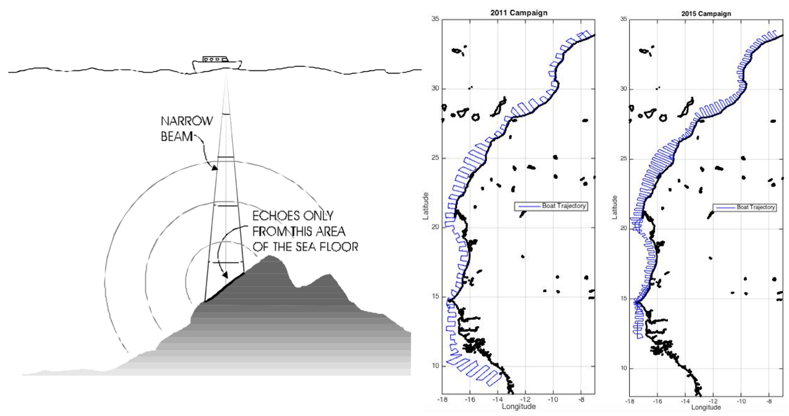
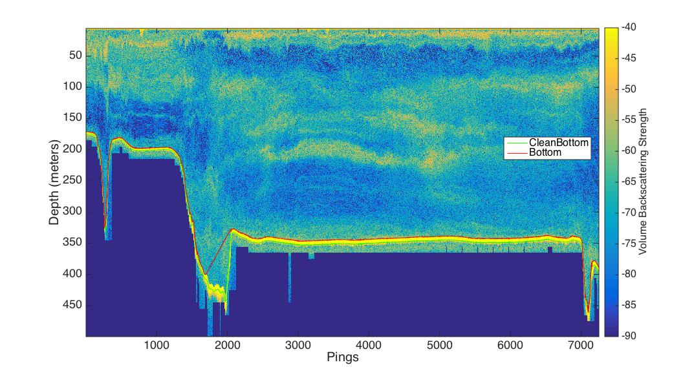
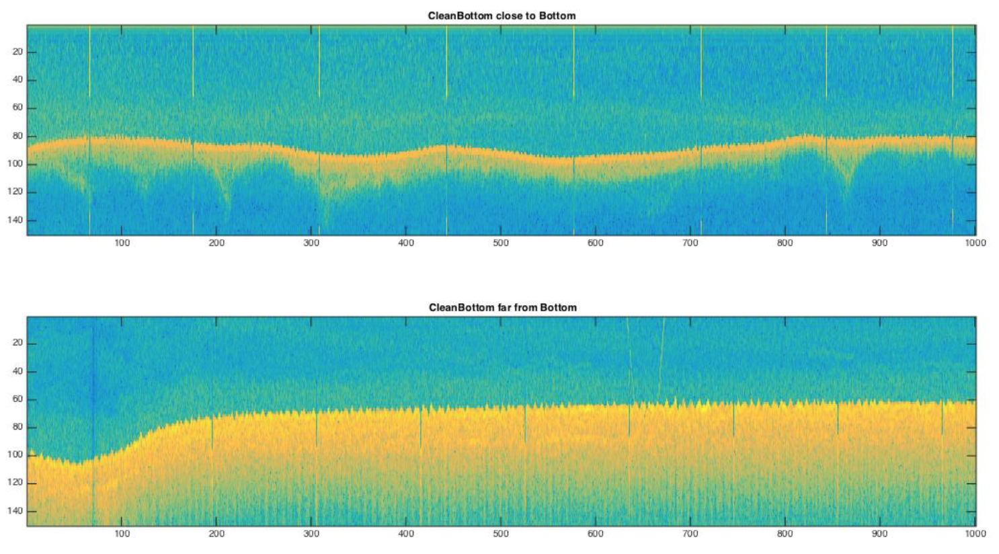

# Seafloor-Classification
## Overview

Huge databases of submarine active acoustic data (echogram) have been collected along the West African coast, 
essentially for fish stock estimation. This task is usually done with echo integration. But the first step is to clearly identify the bottom position on the echogram.  Automatic procedures to detect the bottom depth are not successful when the echogram is unclear, it occurs when the bottom texture is soft or when high-density of fish is present near the seabed. Thus, human expertise is required to review and adjust the bottom prediction made by basic procedures. This data labeling task is typically expensive because all the dataset has to be reviewed. This work aims to use deep learning techniques to classify the echogram, because those models have proven to reach good performance on large datasets, and are able to extract knowledge from complex data. Hence we train a neural network procedure to classify the echogram in different categories depending on whether the bottom is present or not in the echogram and whether it is clear or unclear, i.e. need expert correction. The end goal is to help the expert focus only on the portion of the echogram that needs to be corrected and reduce the total cost of the data labeling process.

## Data
Data are acquired with an echo sounder. The vessel sends out pulses of various frequency’s acoustic waves in the water, those waves are reflected back to the source when they meet diverse organisms (fish, plankton, etc) or more generally solid objects. We call echogram (echo more informally) the corresponding signal.

In the image below
* To the left: the sonar principle is shown at a regular interval the vessel send a pulse of acoustic wave and measure the
reflection in decibel (dB)
* To the right: the path taken by the vessel to collect the data in 2011 and 2015.

 Each pulse is called a ping, and we call echogram (echo more informally) the corresponding signal. After having discussed with the experts' team it appeared that the following variables were relevant to learn from data: Echogram, Depth, Bottom and CleanBottom. For our purpose, following the expert advice we only worked with the lowest frequency (18 kHz) to draw the bottom line (Mainly because it goes deeper). 

* Depth is a vertical grid with a regular spacing and each cell correspond to a value of depth in meters.
* Echogram is associated with Depth, in fact for every ping and every depth there is an echogram value (in dB) .
* Bottom are the value of depth given by the automated procedure (in meters).
* CleanBottom are the values of the bottom after the expert work (in meters).

In summary, the echogram can be viewed as a snapshot of the water where at each time interval (ping) we have diverse values in dB (figure shown below).

## Machine Learning Goal
The task of deriving the true depth of the bottom is expensive because it requires an expert to go through all the echogram (~2-3 millions of pings) and adjust if necessary the bottom prediction of the automatic procedure. In fact, often the errors made by the automatic treatment of the echogram are due to their inability to accurately predict the bottom depth when the seafloor texture is soft or when high density of fish are present close to the seabed.

Hence our goal is to train a machine learning precedure to classify pings in two class:
* Clear bottom (upper picture) 
* Diffuse bottom (lower picture)

## Preprocessing & Data Labeling Process
To feed a neural network we need to remove Not a numbers **Nan** in the data, also to remove pings without bottom, and to create 
labels to distinguish clear bottom and diffuse bottom.
The script making those task is *Preprocessing_and_Labeling.m*. 
* The criterion to create labels is a threshold to separate pings when the automatic procedure fails too much to the human correction.
* The criterion to remove pings without bottom is a domain expert adaptation, in fact the expert use a visual clue, i.e 
a ping without bottom has not "yellow". 

Check the file *Presentation.pdf* for more details.

## Scripts
We used three scripts in the project:
* *OptimizeHP.ipynb* to find the optimal hyperparameters of the model
* *BasicNN.ipynb* to train the model given the standard learning experiment
* *CrossDomainNN.ipynb* to train the model given the cross domain learning experiment

To get further information on the reasons and the set up of those models check up the document *Presentation.pdf*

### Output of the models
*OptimizeHP.ipynb* output the hyperparameters of the model, the number of neuron in the convolutional layers, the fully connected layers and also the dropout rate of the fully connected layers.

*BasicNN.ipynb* output the weights *BasicNN_weights.hdf5* using early stopping and the model trained after a having run for 50 epochs as *BasicNN_final.h5*.
It also output the history of learning in *BasicNN_history.mat*.

*CrossDomainNN.ipynb* output the weights *CDNN_weights.hdf5* using early stopping and the model trained after a having run for 50 epochs as *CDNN_final.h5*.
It also output the history of learning in *CDNN_history.mat*.

These weights can be download and tested on your acoustic data.

## Dependencies
* Languages: Matlab, Python 3.
* Environment: Tensorflow 1.7.
* Libraries: Keras, Numpy, Scipy, H5py, GyOpt.
* Hardware we used for learning: GPU Tesla K80.

